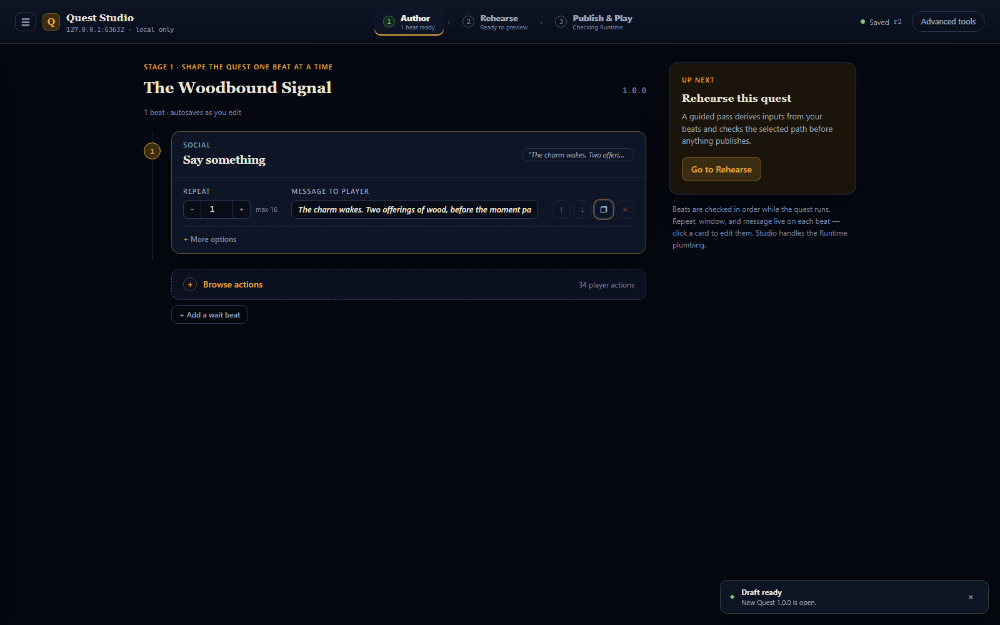
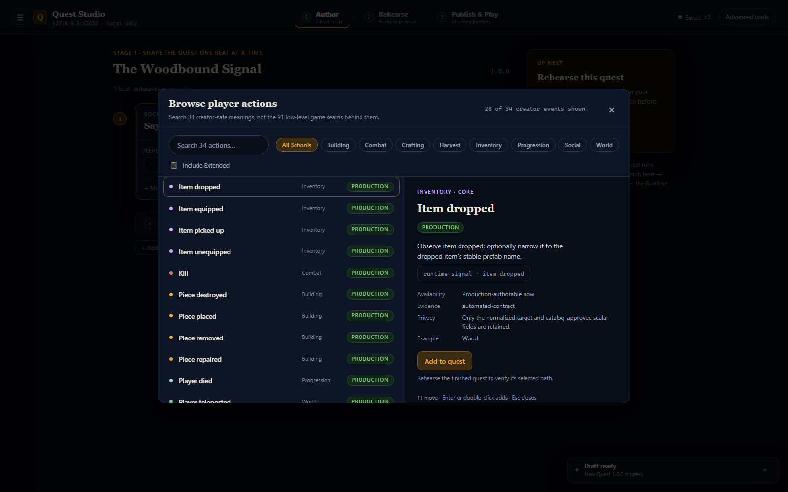
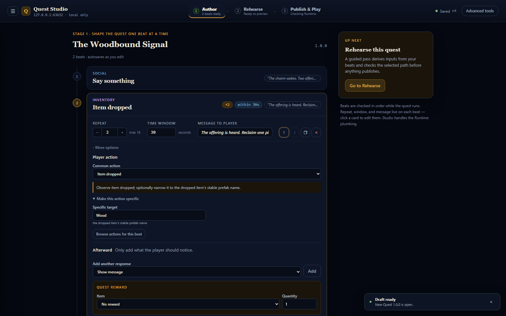
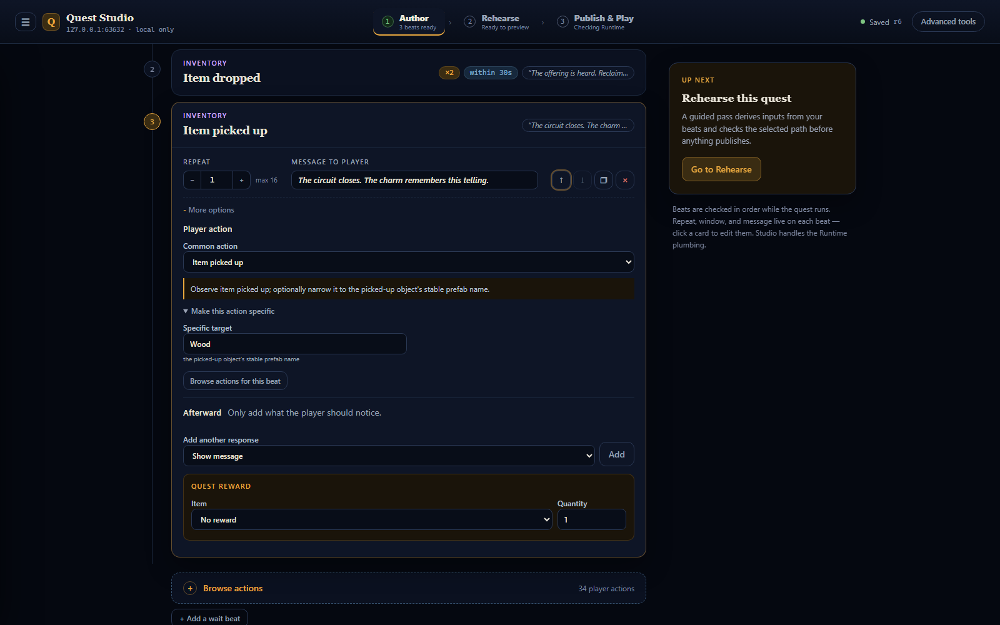
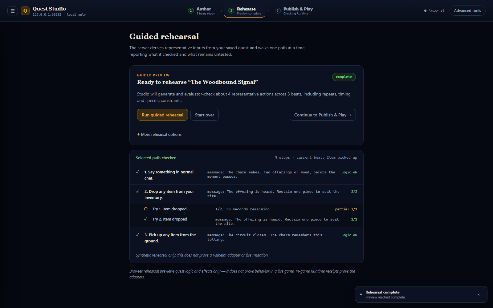
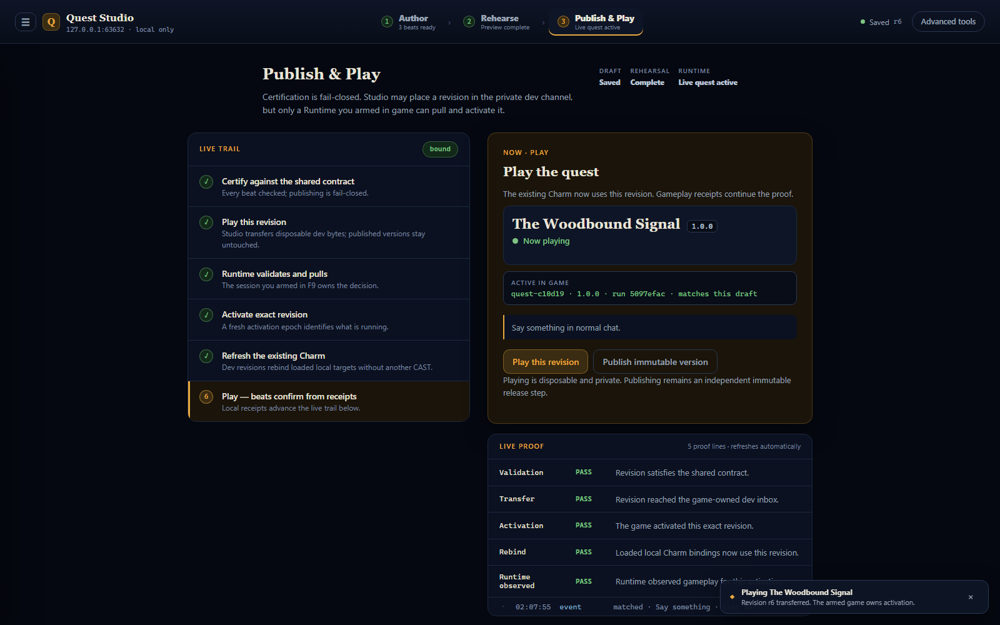

# Your first quest: The Woodbound Signal

This is the same quest the program's first live validation lap played on a private
world: speaking wakes a Charm, two offerings of Wood create a brief rhythm, and
reclaiming one piece seals the rite. It takes about ten minutes to author and uses
three beats, one time window, and nothing else.

Every screenshot below is the real Quest Studio, captured by the same synthetic
browser journey that proves this path on every build
(`tools/quest-studio/Capture-WoodboundTutorial.ps1` regenerates them). What you see
is exactly what you get.

## 1 · Name the quest and wake the charm

Open the quest library (☰), choose **Start blank**, and press **New quest**. Name it
in the title field, then click the first beat card. Every beat answers two questions:
*what does the player do*, and *what should they notice afterward*. For the opening
beat the player action is already **Say something** — type the message the charm
speaks when it hears them.

The quest autosaves as you edit — the dot next to **Saving…** settles to **Saved** on
its own. You never manage files.

## 2 · Browse the player actions

Press **Browse player actions** to add the second beat. The picker holds every
creator-safe thing the game can notice a player doing — 34 meanings, searchable, with
a plain description of each. Pick **Item dropped**.

Use the **Add to quest** button on the preview pane to add it. (Double-click looks
like it should work; the button is the reliable path.)

## 3 · Two offerings, thirty seconds

This is the heart of the rite. On the new beat:

- Open **More options → Make this action specific** and set the target to `Wood` —
  by default the beat accepts any dropped item; this narrows it to the offering.
- Set **Repeat** to `2` and **Time window** to `30` seconds: two offerings, close
  together, or the moment passes.
- Write the message the player sees when the offerings land.

The chips on the beat card — `×2`, `within 30s` — are the same facts you just set,
readable at a glance from the beat list.

## 4 · Seal the rite

Add one more beat the same way — **Item picked up**, specific target `Wood` — and
write the closing message. Reclaiming one piece of the offering is what seals the
telling.

## 5 · Rehearse before anything touches the game

Go to **Rehearse** and press **Run guided rehearsal**. Studio derives representative
player actions from your beats and walks the path through the real quest engine —
including the tricky part. Watch the second beat: the first drop shows as an amber
**partial 1/2, 30 seconds remaining** *under its own beat*, then the second drop
completes it. That is your time window working, proven before any player exists.

The disclaimer at the bottom is honest: rehearsal proves the quest's logic, not the
live game. That proof comes next.

## 6 · Play it

In Valheim, on a private world you control: press `F9` once, confirm the private
world, and **Arm dev channel** — arming lasts for this game session only, and it is
the game that pulls; Studio can never push content into play. Back in Studio, press
**Play this revision**.

Within moments the Publish & Play lane fills itself in: the status card names your
quest — **The Woodbound Signal · Now playing** — and the Live proof panel shows the
game's own receipts: Validation, Transfer, Activation, Rebind, Runtime observed, all
PASS.

In the world, aim at a sign or other charm target, press `` ` `` once to **CHECK**
(the drawer shows READY) and again to **CAST**. The target flares bright purple —
that glow is the binding taking. Then speak, drop two Wood, and pick one back up.
Every message you wrote arrives at its moment, and a countdown pill appears at the
top of the screen while the thirty-second window runs.

## Revise without restarting

Edit any message, return to Publish & Play, and press **Play this revision** again.
The armed game validates and activates the new telling in seconds — no restart, no
re-CAST, and the drawer's evidence feed notes the change. That loop — edit, play,
watch, edit — is the whole point.
